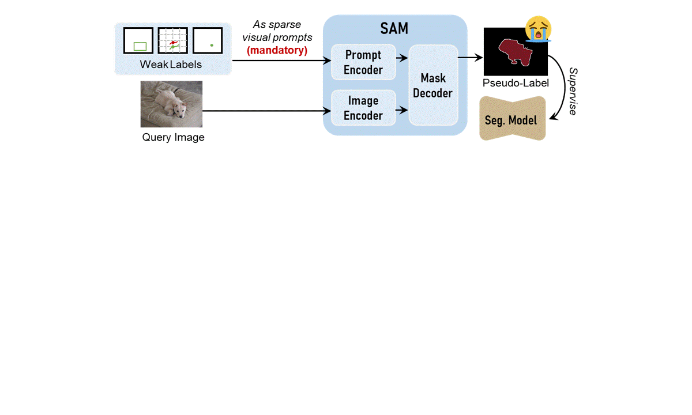

# SAMIX: Reinforcing SAM2 with Semantic Adapter and Reference Selecting Policy for Mix-Supervised Segmentation

[**📖 Paper (CVPR  2026)**](https://openaccess.thecvf.com/content/CVPR2026/html/Hu_SAMIX_Reinforcing_SAM2_with_Semantic_Adapter_and_Reference_Selecting_Policy_CVPR_2026_paper.html)


[Qiang Hu](https://huster-hq.github.io/)<sup>1</sup> &emsp;
Jiajie Wei<sup>1</sup> &emsp;
[Zhenyu Yi](https://scholar.google.com/citations?user=yoY2un8AAAAJ&hl=en)<sup>2</sup> &emsp;
Zhifen Yan<sup>1</sup> &emsp;
Yingjie Guo<sup>1</sup> &emsp;
[Hongkuan Shi](https://scholar.google.com/citations?user=EXgVl7sAAAAJ&hl=en)<sup>3</sup> &emsp;
[Ge-Peng  Ji](https://gewelsji.github.io/)<sup>4</sup> &emsp;
[Qiang  Li](https://faculty.hust.edu.cn/liqiang15/zh_CN/index.htm)<sup>1</sup> &emsp;
[Zhiwei Wang](https://andysis.github.io/)<sup>1✉</sup> &emsp;

<sup>1</sup>Huazhong University of Science and Technology &emsp; <sup>2</sup>Shanghai Jiao Tong University &emsp; <sup>3</sup>Wuhan United Imaging Surgical Healthcare Co., Ltd. &emsp;<sup>4</sup>Australian National University &emsp;

<sup>✉</sup> Corresponding Author.


## 🚀Overview
SAMIX is a RL-empowered in-context segmenter comprising two core components: SA-SAM2 and SPNet. SA-SAM2 leverages a lightweight semantic adapter to transform the vanilla SAM2 into an in-context segmenter, enabling cross-image semantic tracking capabilities. Importantly, SPNet is trained via GRPO with customized verifiable rewards to retrieve valuable visual contexts from a data pool for the query image, effectively empowering SA-SAM2.
We emoplpy SAMIX in a mix-supervised segmentation framework, where
We employ SAMIX within a mix-supervised segmentation framework, including mask/box/scribble/point/class-labeled data and unlabeled data. SAMIX is capable of leveraging the in-context segmentation paradigm and utilizing data (with finer-supervision) as in-context examples to provide dense contextual prompts for data (with lower-supervision), thereby offering more reliable pseudo-labels for downstream segmentation models.



<!-- This repository currently releases the `SA-SAM2` and co-training parts of the
project:

- `SA-SAM2`: a SAM2-based in-context segmentor with semantic adapters inserted
  into the image encoder
- `Polyp-PVT + EMA`: an auxiliary segmentation model used during co-training
- a mixed-supervision training framework for `mask / box / scribble / point`

`SPNet` is not included yet. -->
<!-- 
## Highlights

- Official `SAM2` is used as the base model
- Only adapter parameters are updated during warmup
- Support samples are selected from the full-mask pool with nearest-neighbor
  retrieval over `SA-SAM2` image-encoder features
- TensorBoard logging, evaluation, checkpoints, and qualitative visualizations
  are integrated into the training pipeline -->

## Repository Layout

```text
SAMIX/
|-- README.md
|-- requirements.txt
|-- .gitmodules
|-- docs/
|   `-- data_format.md
|-- examples/
|   `-- dataset_manifest.example.json
|-- external/
|   `-- sam2/                  # official SAM2 submodule
|-- samix/
|   |-- adapters.py
|   |-- data.py
|   |-- ema.py
|   |-- eval.py
|   |-- framework.py
|   |-- losses.py
|   |-- model_utils.py
|   |-- polyp_pvt.py
|   |-- prompts.py
|   |-- sa_hiera.py
|   |-- sa_sam2.py
|   |-- training.py
|   `-- visualization.py
`-- scripts/
    |-- build_manifest.py
    |-- prepare_joint_polyp_dataset.py
    |-- prepare_polyp_train_layout.py
    |-- train.sh
    `-- train_cotrain.py
```

Large assets such as datasets, run outputs, and checkpoints are intentionally
excluded from the repository.

## ⚙️ Environment Setup  

### 1. Create environment

Recommended baseline:

- Python `3.10`
- PyTorch `2.5.1`
- CUDA `12.4`

Install Python dependencies:

```bash
pip install -r requirements.txt
```

### 2. Initialize SAM2 submodule

```bash
git submodule update --init --recursive
```

### 3. Install official SAM2

```bash
cd external/sam2
pip install -e .
```

### 4. Download SAM2 checkpoints

Use the official checkpoint script inside the SAM2 submodule, or provide your
own checkpoint path when launching training.


## 📊 Data Preparation

The repository supports a unified mixed-supervision layout. See:

- [docs/data_format.md](docs/data_format.md)
- [examples/dataset_manifest.example.json](examples/dataset_manifest.example.json)

For the polyp experiments in this codebase, the training script expects a
manifest JSON that enumerates training samples and their supervision type.


## 📈️ Training

The recommended entrypoint is:

```bash
bash scripts/train.sh
```

The default script configuration uses:

- `SAM2.1 Hiera Tiny`
- warmup for `10` epochs
- joint training for `50` epochs
- dual-GPU split by default:
  - `SA-SAM2 -> cuda:0`
  - `Seg-Model + EMA -> cuda:1`

You can override defaults through environment variables:

```bash
BATCH_SIZE=4 OUTPUT_DIR=/path/to/output bash scripts/train.sh
```

Or call the Python entrypoint directly:

```bash
python scripts/train_cotrain.py \
  --manifest /path/to/manifest.json \
  --sam2-root external/sam2 \
  --sam2-ckpt /path/to/sam2.1_hiera_tiny.pt \
  --sam2-config configs/sam2.1/sam2.1_hiera_t.yaml
```

## Logging and Evaluation

During training, the framework records:

- warmup and co-training losses
- TensorBoard scalar curves
- qualitative visualizations for support/query/prediction examples
- per-dataset test results on:
  - `CVC-300`
  - `CVC-ClinicDB`
  - `CVC-ColonDB`
  - `ETIS-LaribPolypDB`
  - `Kvasir`
- mean `Dice` and mean `IoU`

<!-- ## Current Status

Implemented:

- `SA-SAM2` with semantic adapters in the SAM2 image encoder
- `Polyp-PVT + EMA`
- warmup + co-training framework
- mixed-supervision data loading
- nearest-neighbor support selection
- TensorBoard logging and test-set evaluation

Not yet released:

- `SPNet`
- final benchmark-specific training recipes
- released paper checkpoints -->


## Citation

If you use this repository, please cite the SAMIX paper. Final BibTeX metadata
will be added in the public release.


## Acknowledgements

This codebase builds on:

- the official `SAM2` project
- `SANSA` for the semantic adapter design reference
- `Polyp-PVT` for the auxiliary segmentation model family
