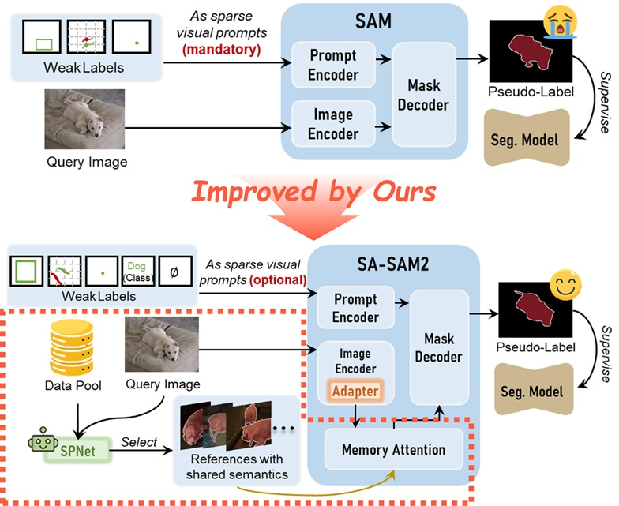

# SAMIX: Reinforcing SAM2 with Semantic Adapter and Reference Selecting Policy for Mix-Supervised Segmentation (CVPR 2026)

<div align="center">

[**📖 Paper**](https://openaccess.thecvf.com/content/CVPR2026/html/Hu_SAMIX_Reinforcing_SAM2_with_Semantic_Adapter_and_Reference_Selecting_Policy_CVPR_2026_paper.html)

[Qiang Hu](https://huster-hq.github.io/)<sup>1</sup> ·
Jiajie Wei<sup>1</sup> ·
[Zhenyu Yi](https://scholar.google.com/citations?user=yoY2un8AAAAJ&hl=en)<sup>2</sup> ·
Zhifen Yan<sup>1</sup> ·
Yingjie Guo<sup>1</sup> ·
[Hongkuan Shi](https://scholar.google.com/citations?user=EXgVl7sAAAAJ&hl=en)<sup>3</sup> ·
[Ge-Peng  Ji](https://gewelsji.github.io/)<sup>4</sup> ·
[Qiang  Li](https://faculty.hust.edu.cn/liqiang15/zh_CN/index.htm)<sup>1</sup> ·
[Zhiwei Wang](https://andysis.github.io/)<sup>1✉</sup> ·

<sup>1</sup>HUST &emsp; <sup>2</sup>SJTU &emsp; <sup>3</sup>Wuhan United Imaging Surgical Healthcare Co., Ltd. &emsp;<sup>4</sup>ANU &emsp;
</div>

## 🚀Overview

**Problem Formulation:** Mix-supervised Segmentation aims to train a single segmentation model using heterogeneous-annotated data, including mask, box, scribble, point, class-labled, and unlabled data.

**Paradigm Comparison:**

- Exsing SAM-based methods (1) heavily rely on sparse spatial prompts (e.g., box, point); (2) can not address scenarios with ambiguous boundaries; (3) can not use class-labeled and unlabeled data for training; (4) overlooks the potential of collaborative learning across heterogeneous data.

- Ours (1) repurpose the SAM2's instance tracking mechanism to promote semantic tracking across data, i.e., *in-context segmentation*; (2) introduce a *RL-empowered Network* to actively select in-context examples for each query; (3) can use class-labeled and unlabeled data for training; (4) achieve collaborative learning across heterogeneous data.

<p align="center">

<p>


## ⚙️ Environment Setup  

### 1. Create environment

Recommended baseline:

- Python `3.10`
- PyTorch `2.5.1`
- CUDA `12.4`

Install Python dependencies:

```bash
pip install -r requirements.txt
```

### 2. Initialize SAM2 submodule

```bash
git submodule update --init --recursive
```

### 3. Install official SAM2

```bash
cd external/sam2
pip install -e .
```

### 4. Download SAM2 checkpoints

Use the official checkpoint script inside the SAM2 submodule, or provide your
own checkpoint path when launching training.


## 📊 Data Preparation

The repository supports a unified mixed-supervision layout. See:

- [docs/data_format.md](docs/data_format.md)
- [examples/dataset_manifest.example.json](examples/dataset_manifest.example.json)

For the polyp experiments in this codebase, the training script expects a
manifest JSON that enumerates training samples and their supervision type.


## 📈️ Training

The recommended entrypoint is:

```bash
bash scripts/train.sh
```

The default script configuration uses:

- `SAM2.1 Hiera Tiny`
- warmup for `10` epochs
- joint training for `50` epochs
- dual-GPU split by default:
  - `SA-SAM2 -> cuda:0`
  - `Seg-Model + EMA -> cuda:1`

You can override defaults through environment variables:

```bash
BATCH_SIZE=4 OUTPUT_DIR=/path/to/output bash scripts/train.sh
```

Or call the Python entrypoint directly:

```bash
python scripts/train_cotrain.py \
  --manifest /path/to/manifest.json \
  --sam2-root external/sam2 \
  --sam2-ckpt /path/to/sam2.1_hiera_tiny.pt \
  --sam2-config configs/sam2.1/sam2.1_hiera_t.yaml
```

## Logging and Evaluation

During training, the framework records:

- warmup and co-training losses
- TensorBoard scalar curves
- qualitative visualizations for support/query/prediction examples
- per-dataset test results on:
  - `CVC-300`
  - `CVC-ClinicDB`
  - `CVC-ColonDB`
  - `ETIS-LaribPolypDB`
  - `Kvasir`
- mean `Dice` and mean `IoU`

<!-- ## Current Status

Implemented:

- `SA-SAM2` with semantic adapters in the SAM2 image encoder
- `Polyp-PVT + EMA`
- warmup + co-training framework
- mixed-supervision data loading
- nearest-neighbor support selection
- TensorBoard logging and test-set evaluation

Not yet released:

- `SPNet`
- final benchmark-specific training recipes
- released paper checkpoints -->


## Citation

If you use this repository, please cite the SAMIX paper. Final BibTeX metadata
will be added in the public release.


## Acknowledgements

This codebase builds on:

- the official `SAM2` project
- `SANSA` for the semantic adapter design reference
- `Polyp-PVT` for the auxiliary segmentation model family
